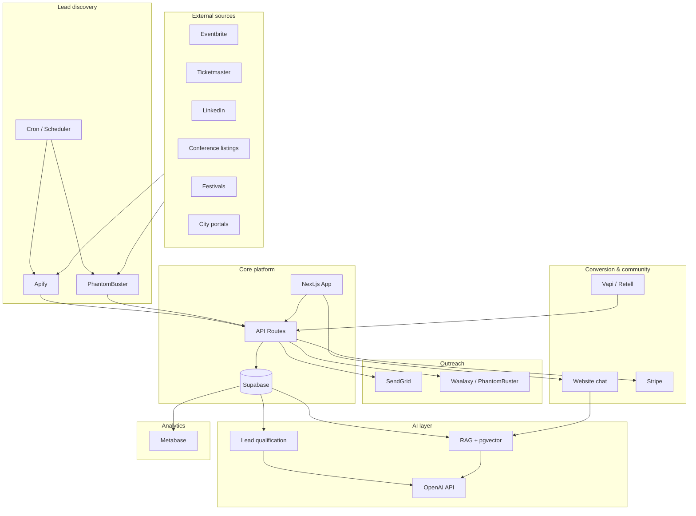

# Accessify.live — Access Shapers Growth Engine
## Full system design: lead discovery → automated purchase → movement

**Version:** 1.0  
**Target region:** DACH (Germany, Switzerland, Austria)  
**Mission:** *Inclusion through synergy.*  
**Movement:** Access Shapers — event organizers shaping the future of inclusive experiences.

**Product:** Accessify is a *low-latency accessibility layer for physical live events* (not a livestream platform). It captures live audio from the event and delivers real-time transcription, translation, captions on smartphones, and optional audio description and sign language. Works without a livestream. See `docs/PRODUCT_DEFINITION.md`.

---

## Table of contents

1. [Movement narrative & positioning](#1-movement-narrative--positioning)
2. [Lead discovery engine](#2-lead-discovery-engine)
3. [AI lead qualification](#3-ai-lead-qualification)
4. [Law-trigger sales strategy](#4-law-trigger-sales-strategy)
5. [Outreach automation](#5-outreach-automation)
6. [Content engine](#6-content-engine)
7. [Access Shaper community](#7-access-shaper-community)
8. [Website conversion flow](#8-website-conversion-flow)
9. [AI conversation agent (RAG)](#9-ai-conversation-agent-rag)
10. [AI phone agent](#10-ai-phone-agent)
11. [Newsletter automation](#11-newsletter-automation)
12. [Analytics dashboard](#12-analytics-dashboard)
13. [System architecture](#13-system-architecture)

---

## 1. Movement narrative & positioning

### Access Shapers movement

**Core message:**  
*"Become an AccessShaper. Join a growing movement of events reaching millions of visitors by making live experiences truly accessible."*

**What Access Shapers represent:**
- Inclusive events
- Accessible digital experiences
- Global reach
- Social responsibility

**Messaging pillars for all touchpoints:**
- **Identity:** "You're not just adding captions — you're shaping the future of live experiences."
- **Proof:** "Events using Accessify are already reaching millions with real-time captions and translation on attendees’ smartphones."
- **Call to action:** "Join the Access Shapers. Make your next event accessible."

### Mission: inclusion through synergy

**Hybrid model (differentiator):**

| Entity | Role | Responsibilities |
|--------|------|------------------|
| **Accessify Association** (non-profit) | Guardian of the mission | Protect inclusion principles; collaborate with disability communities; finance inclusion via grants; develop high-impact, non-commercial tech (e.g. ultra-low-latency captions, deaf/VI accessibility). |
| **iRewind** (for-profit) | Global rollout partner | Technology scaling; large event support; commercial infrastructure; reliability of the accessibility layer. |

**Story to integrate everywhere:**  
*"Accessify is powered by a unique model: a non-profit association guarding inclusion and a technology partner scaling it globally. Social impact meets global reach."*

---

## 2. Lead discovery engine

### Objective

Automatically discover live events across DACH and store structured leads in a CRM (Supabase as source of truth).

### Data sources (priority order)

| Source | Type | Method | Frequency |
|--------|------|--------|-----------|
| Eventbrite | API / Apify | Apify Eventbrite Scraper or official API | Daily |
| Ticketmaster | API | Ticketmaster Discovery API | Daily |
| Conference listings | Scraper | Apify (e.g. Google Search, custom) | 2×/week |
| Festival directories | Scraper | Apify, manual lists (e.g. festival.de) | Weekly |
| Sports event calendars | API/Scraper | League/venue APIs, Apify | Weekly |
| Trade fairs | Scraper | Messe.de, trade fair indexes, Apify | Weekly |
| City event portals | Scraper | City websites (Berlin, Munich, Vienna, Zurich, etc.) | Weekly |
| LinkedIn events | Automation | PhantomBuster LinkedIn Events scraper | 2×/week |
| Google Maps event venues | Scraper | Apify Google Maps Scraper (venues → events) | Weekly |

### Extracted fields (per lead)

- `event_name`, `organizer_company`, `organizer_website`, `contact_email`
- `linkedin_url` (company or organizer)
- `event_type` (conference, festival, sports, trade_fair, etc.)
- `event_date`, `location_city`, `location_country`
- `estimated_audience_size`, `languages_count`, `international_visitors_score`, `public_visibility`, `accessibility_relevance`
- `source`, `source_url`, `discovered_at`

### Implementation approach

- **Orchestrator:** Next.js API routes or Supabase Edge Functions + cron (e.g. Vercel Cron, or external scheduler hitting webhooks).
- **Scraping/APIs:** Apify actors for scraping; native APIs where available (Eventbrite, Ticketmaster). Store raw results in `raw_discoveries` then normalize into `leads`.
- **Deduplication:** Match on `(event_name, organizer_company, event_date)` or fuzzy match + manual review queue.
- **CRM storage:** All canonical data in Supabase (`leads`, `lead_events`, `lead_activities`). Optional sync to HubSpot/Airtable via webhooks or scheduled jobs for sales team.

### Database (see schema)

- `leads` — one per organizer/company with contact info.
- `lead_events` — one per event; FK to `leads`.
- `discovery_runs` — log of each discovery job for idempotency and debugging.

---

## 3. AI lead qualification

### Objective

Score each lead (event + organizer) so that:
- **Tier A:** Immediate outreach (high fit, high urgency).
- **Tier B:** Nurturing sequence (good fit, less urgency).
- **Tier C:** Long-term pipeline (low fit or far future).

### Scoring dimensions (0–100 each, then weighted)

| Dimension | Weight | Signals |
|-----------|--------|--------|
| Event size | 25% | `estimated_audience_size`; if missing, infer from event type/venue. |
| International audience | 20% | Multi-country promotion, “international” in title, language clues. |
| Languages / multilingual | 20% | `languages_count`; many languages spoken or offered at the event. |
| Event category | 15% | Conference, festival, trade fair, sports, cultural. |
| Accessibility relevance | 15% | Sector: public, government, education, culture, health; mission fit. |
| Public visibility | 5% | Open registration, media coverage, high-profile event. |

*Accessify is an accessibility layer for physical live events (not a livestream platform). Livestream is not a scoring factor.*

### Tier thresholds (configurable)

- **Tier A:** Total score ≥ 70, event within 90 days.
- **Tier B:** Total score 40–69, or event in 90–180 days.
- **Tier C:** Score < 40 or event > 180 days.

### Implementation

- **Input:** One row from `lead_events` (joined with `leads`).
- **Model:** OpenAI API (e.g. `gpt-4o-mini`) with a structured prompt that outputs JSON: `{ "audience_size_score", "languages_score", "international_score", "event_category_score", "accessibility_relevance_score", "public_visibility_score", "tier", "reasoning" }`.
- **Storage:** Write scores and tier to `lead_events.qualification_score`, `lead_events.qualification_tier`, `lead_events.qualification_reasoning`, `lead_events.qualified_at`.
- **Automation:** Triggered after new event is discovered and normalized (e.g. Supabase trigger or queue job). Batch processing for cost efficiency.

### AI prompt (summary)

- System: “You are a B2B lead qualifier for Accessify.live, which sells accessibility for live events (captions, translation, audio description, inclusive streaming) in DACH.”
- User: Provide event name, type, date, location, audience size, livestream yes/no, organizer type, and any description text. Ask for JSON scores per dimension and tier (A/B/C) with short reasoning.
- Parse JSON, validate, then update DB.

*(Full prompt text is in `ai-prompts/lead-qualification.md`.)*

---

## 4. Law-trigger sales strategy

### Objective

Use regulatory awareness (especially European Accessibility Act — EAA) as a trigger for engagement without fear-mongering. Position Accessify as the practical solution.

### Key regulations to reference

- **European Accessibility Act (EAA):** Obligations for certain services (including digital services and elements of live experiences) to be accessible; transposition in member states.
- **National laws:** German BFSG, Austrian federal law, Swiss DDA and cantonal rules — reference in DACH-specific content.
- **Public procurement:** Accessibility criteria in tenders; good fit for public-sector events.

### Educational assets to create and automate

1. **Event accessibility checklist (PDF/landing page)**  
   - Pre-event: captions, sign language, accessible registration, info in multiple formats.  
   - During: real-time captions and translation on smartphones; optional audio description and sign language.  
   - Post-event: accessible recordings, summaries.  
   - CTA: “See how Accessify supports each step.”

2. **Regulatory overview (blog + PDF)**  
   - “Accessibility regulations for events in DACH: what you need to know.”  
   - EAA timeline, scope, and what “accessible” can mean for live events and streams.  
   - Gated or ungated; used in email sequences and LinkedIn.

3. **Practical implementation examples**  
   - Short case studies: “How event X added captions and stayed compliant.”  
   - Link to Access Shaper case studies and product pages.

### Integration into sequences

- **Email:** Day 8 in sequence = “Are your livestreams ready for accessibility rules?” + link to regulatory overview and checklist.
- **LinkedIn:** One touchpoint = “Many digital experiences and livestreams must soon be accessible. Here’s a short overview [link].”
- **Website:** Dedicated “Accessibility & regulations” sub-section under Resources, linked from pricing and demo CTAs.

---

## 5. Outreach automation

### Channels

- **Email:** SendGrid (transactional + marketing).  
- **LinkedIn:** PhantomBuster or Waalaxy (connection requests, messages, content sharing).

### Email sequence (example)

| Day | Subject / content idea |
|-----|------------------------|
| 1 | Introduction to Accessify and the Access Shaper movement; what we do (captions, translation, audio description, inclusive streaming). CTA: “See how it works.” |
| 4 | Case study: one Access Shaper event (anonymized or named) — problem, solution, outcome. CTA: “Read the full story.” |
| 8 | Accessibility regulations (EAA and events); why it matters for livestreams and digital experiences. Link to regulatory overview + checklist. CTA: “Download the checklist.” |
| 14 | Invitation to join the Access Shaper community; badge, directory, recognition. CTA: “Join the movement.” |
| 21 | Personalised demo invitation; calendar link (Calendly/Cal.com). CTA: “Book a 15‑min demo.” |

- **Unsubscribe:** Every email must include unsubscribe link (SendGrid list management).
- **Reply handling:** Replies go to a dedicated inbox; optional AI-assisted first response (see AI conversation agent) or human handoff.

### LinkedIn sequence (example)

1. **Connection request** (short): “Hi [Name], I’m reaching out to event organizers who care about accessibility. Would be glad to connect.”  
2. **Message 1 (after accept):** Brief intro to accessible events and Access Shapers; link to movement page.  
3. **Message 2:** Share article about accessibility law (blog or LinkedIn article).  
4. **Message 3:** Invite to demo or to download the checklist.

- **Tooling:** PhantomBuster or Waalaxy workflows; daily caps to respect LinkedIn limits; store “last LinkedIn step” and “next action” in CRM.

### Automation logic

- **Trigger:** Lead in Tier A or B and `outreach_started_at` null → start email sequence and (if LinkedIn URL present) add to LinkedIn workflow.
- **Tracking:** Log each send and open/click in `lead_activities` (SendGrid webhooks + UTM). Use this for “reply rate” and “demo bookings” in analytics.
- **Pause conditions:** If lead books demo, becomes customer, or unsubscribes, stop sequences and mark `outreach_paused_reason`.

---

## 6. Content engine

### Purpose

Produce consistent, professional content that drives traffic to https://accessify.live and supports SEO, outreach, and community.

### Content types and cadence

| Type | Cadence | Primary channel |
|------|---------|-----------------|
| Blog | Every 2 weeks | accessify.live/blog |
| LinkedIn (organic) | Weekly | Company page + key people |
| Newsletter | Every 2 weeks | SendGrid → list |

### Topic clusters

1. **Event accessibility** — how to make events accessible, checklists, best practices.  
2. **European accessibility regulations** — EAA, DACH-specific, implications for events.  
3. **Real-time accessibility at live events** — captions, translation, audio description on smartphones.  
4. **Accessibility technology** — how Accessify works, latency, integration.  
5. **Access Shaper success stories** — case studies, quotes, impact metrics.

### Production workflow

- **Ideation:** Keyword research (e.g. “Barrierefreiheit Events”, “accessible livestream”) + internal list of pillar topics.  
- **Creation:** Human-written or AI-assisted (GPT) with strict fact-check and brand voice; always include mission/movement and CTA to accessify.live.  
- **Publishing:** Next.js MDX or CMS (e.g. Sanity/Contentful) for blog; LinkedIn native; newsletter via SendGrid template.  
- **Distribution:** Blog linked in emails and LinkedIn; newsletter signup on site and in sequences.

### SEO and links

- All content links back to homepage, movement page, product, and pricing/demo.  
- Target keywords: event accessibility DACH, Barrierefreiheit Events, EAA events, Access Shapers, inclusive live events.

---

## 7. Access Shaper community

### Concept

Event organizers who implement accessibility through Accessify become **Access Shapers** and are part of a visible movement with recognition and shared impact.

### Elements

1. **Access Shaper badge**  
   - “Official Access Shaper Event” (and/or “Powered by Accessify”).  
   - Provided as asset (PNG/SVG) and optional embed snippet for event websites.  
   - Stored in CRM which events/organizations are Access Shapers (e.g. `customers` or `access_shaper_events`).

2. **Directory of accessible events**  
   - Public page on accessify.live: “Access Shaper events” — list of events (name, date, location, type) with optional short description.  
   - Data from CRM: events that have completed at least one Accessify project and opted in.

3. **Case study features**  
   - Dedicated case study pages (e.g. /case-studies/[slug]).  
   - Optional “Featured Access Shaper” in newsletter and blog.

4. **Community recognition**  
   - Newsletter shout-outs, LinkedIn features, impact stats (“X events, Y audiences reached”).

### Website pages

- **Movement page** (/access-shapers): What Access Shapers are; “Become an Access Shaper”; benefits (badge, directory, impact); CTA to get started.  
- **Community page** (/community or /access-shapers/community): Directory, stats, recent case studies.  
- **Impact statistics** (component on homepage and movement page):  
  - Events using Accessify  
  - Audiences reached  
  - Languages supported  
  - People with disabilities reached (estimate or survey-based)

- **Data model:** `access_shaper_events` (event_id, organizer_id, badge_issued_at, featured, case_study_url, opt_in_directory).

---

## 8. Website conversion flow

### Objective

A clear path from first visit to purchase and onboarding, aligned with the movement narrative and mission.

### Proposed page flow

1. **Landing / Home**  
   - Mission (“Inclusion through synergy”); hybrid model (Association + iRewind); hero with value prop; social proof (Access Shapers, impact stats).  
   - CTAs: “See how it works”, “Join Access Shapers”, “Book a demo”.

2. **Access Shaper movement** (/access-shapers)  
   - What it means to be an Access Shaper; benefits; directory teaser; impact.  
   - CTA: “Make your event accessible” → product or pricing.

3. **Accessibility & regulations** (/resources/accessibility-regulations or /compliance)  
   - EAA and events; checklist; practical implications.  
   - CTA: “Get the checklist”, “See how Accessify helps”.

4. **Product** (/product or /how-it-works)  
   - Services: ultra-low latency audio capture; real-time transcription and translation; captions on smartphones; optional audio description and sign language.  
   - How it works (high level); integration options.  
   - CTA: “Calculate your event”, “Book a demo”.

5. **Pricing calculator** (/pricing or /get-a-quote)  
   - Inputs: event type, duration, audience size, languages, services (captions, translation, etc.).  
   - Output: indicative price or range; CTA: “Request proposal” or “Start project”.

6. **Event configuration** (/configure or /request-demo)  
   - Collect: event name, date, organizer, contact, services needed.  
   - Creates lead in CRM and optionally triggers demo workflow.

7. **Checkout process**  
   - For self-serve: cart of services → payment (Stripe).  
   - For sales-led: “Request proposal” → internal workflow → contract/sign → payment.  
   - Post-purchase: redirect to onboarding.

8. **Project onboarding**  
   - Logged-in area or dedicated flow: confirm event details, integration (stream URL, etc.), timeline, contact for delivery.  
   - Optional checklist and status (“We’re preparing your accessible event”).

### Technical notes

- Next.js App Router; Supabase for auth and CRM data; Stripe for payment.  
- Forms submit to API routes that write to Supabase and optionally trigger SendGrid/automation.  
- All key pages should have chat widget (AI agent) and clear CTAs to demo/newsletter.

---

## 9. AI conversation agent (RAG)

### Objective

An AI assistant that answers product, pricing, technical, and compliance questions and can collect demo requests. Available on website chat, and optionally for email reply suggestions.

### Architecture: RAG

- **Knowledge base:** Curated documents (PDFs, markdown) about Accessify: product, pricing logic, integration, EAA/compliance, Access Shapers, hybrid model, FAQ.  
- **Embeddings:** OpenAI `text-embedding-3-small` (or similar); chunks stored in Supabase (pgvector) or in a vector store (e.g. LangChain + Supabase vector).  
- **Retrieval:** User question → embed → similarity search → top-k chunks.  
- **Generation:** LLM (e.g. GPT-4o) with system prompt that includes: mission, movement, product summary, and “answer only from context or say you don’t know; for pricing suggest the calculator; for demos suggest booking.”  
- **Stack:** LangChain (or direct OpenAI) + Supabase pgvector; optional LangSmith for tracing.

### Channels

- **Website chat:** Embeddable widget (e.g. custom React component or third-party that calls your API).  
- **Email:** Optional: when a reply is detected, suggest a first-response draft using the same RAG API.  
- **Help assistant:** Same backend used from a “Help” or “Ask” page on the site.

### Behaviours

- Answer product questions (captions, translation, audio description, smartphone access; clarify that Accessify is an accessibility layer, not a livestream platform).  
- Explain pricing approach and direct to /pricing.  
- Explain compliance (EAA) at high level and link to resources.  
- Demo requests: collect name, email, event summary and create lead + send to Calendly or internal calendar.  
- Escalation: “Talk to sales” or “Book a call” when intent is complex or commercial.

### Prompts

- System prompt and few-shot examples in `ai-prompts/rag-chat-agent.md`.  
- Knowledge base outline in `ai-prompts/knowledge-base-outline.md`.

---

## 10. AI phone agent

### Objective

Voice AI that can explain services, answer compliance questions, book demos, and guide users toward purchase. Target: DACH (German primary, English fallback).

### Suggested platforms

- **Vapi** or **Retell AI:** both support voice AI, custom prompts, and integrations (CRM, calendar).  
- **Flow:** Inbound number → greet → intent detection (info vs. demo vs. pricing) → answer or collect details → book demo (e.g. Calendly API) or send link to pricing/demo page.

### Capabilities

- Explain Accessify services (real-time captions, translation, audio description; attendees use smartphones; no livestream required).  
- Answer high-level compliance questions (EAA, “what do I need to do”).  
- Book demo: collect name, email, event; create lead in Supabase; return Calendly link or confirm slot.  
- Guide to purchase: “Visit accessify.live/pricing or I can have someone call you.”

### Integration

- Webhook from Vapi/Retell to Next.js API → create/update lead in Supabase, trigger SendGrid or calendar.  
- Store call summary and outcome in `lead_activities` for analytics.

### Prompts

- Voice agent system prompt and example dialogs in `ai-prompts/voice-agent.md`.

---

## 11. Newsletter automation

### Setup

- **ESP:** SendGrid.  
- **Signup:** Form on accessify.live (footer, movement page, blog); optional lead magnet (checklist, regulatory overview).  
- **List:** “Access Shapers Newsletter” or “Event Accessibility Insights”; store consent and list id in Supabase (`newsletter_subscribers`).

### Automated sequence (post signup)

- **Welcome (immediate):** “Welcome to Access Shapers” — mission, what to expect, link to movement and product.  
- **Ongoing (every 2 weeks):**  
  - Accessibility insights (short tips, regulation updates).  
  - Case studies (Access Shaper events).  
  - Product updates (new features, languages).  
  - Industry news (curated links).  

- **Segmentation (optional):** Tag by interest (organizer vs. accessibility professional) and tailor content.

### Technical

- Signup form → API route → SendGrid contact create + add to list; store in Supabase.  
- Campaigns: SendGrid templates; schedule 2-weekly via SendGrid or cron that triggers “send latest newsletter” API.

---

## 12. Analytics dashboard

### Goal

Single view of pipeline health: discovery → outreach → demos → conversions → Access Shapers.

### Metrics to track

| Metric | Source |
|--------|--------|
| Leads discovered (total, by source, by tier) | Supabase `lead_events`, `discovery_runs` |
| Emails sent, opened, clicked | SendGrid webhooks → `lead_activities` |
| Reply rate | SendGrid events + manual tag or keyword |
| Demo bookings | Calendly/webhook or form submission → `lead_activities` |
| Website conversions (quote request, signup, purchase) | Supabase + UTM / events |
| Access Shaper signups | Supabase `access_shaper_events` or `customers` |

### Tooling

- **Metabase** or **Retool:** Connect to Supabase; build dashboards and alerts.  
- **Supabase:** Raw tables; optional materialized views for daily aggregates.  
- **SendGrid:** Native analytics for opens/clicks; webhook events stored in DB for join with leads.

### Suggested dashboards

1. **Discovery:** Leads per day/week, by source, by tier (A/B/C).  
2. **Outreach:** Emails sent, open rate, click rate, replies, by sequence step.  
3. **Conversions:** Demo requests, quote requests, purchases over time.  
4. **Access Shapers:** Count of events/organizations, audiences reached, languages.

---

## 13. System architecture

### High-level diagram (Mermaid)

### Stack summary

| Layer | Technology |
|-------|------------|
| Frontend / marketing site | Next.js (App Router) |
| Backend / API | Next.js API routes, Supabase Edge Functions (optional) |
| Database / auth | Supabase (PostgreSQL, auth, pgvector) |
| AI | OpenAI API, LangChain (optional) |
| Email | SendGrid |
| LinkedIn automation | PhantomBuster or Waalaxy |
| Scraping / discovery | Apify |
| Payments | Stripe |
| Analytics / dashboards | Metabase or Retool |
| Voice AI | Vapi or Retell AI |

### Deployment strategy

- **Next.js:** Vercel (recommended); env vars for Supabase, OpenAI, SendGrid, Stripe.  
- **Supabase:** Hosted project; migrations via Supabase CLI; RLS for security.  
- **Cron:** Vercel Cron for discovery and qualification jobs; or external (e.g. cron-job.org) hitting authenticated API routes.  
- **Secrets:** Vercel env + Supabase secrets; no keys in repo.

### API integrations (summary)

- **Apify:** Run actors via API; store run id and results; parse into `raw_discoveries` then `lead_events`/`leads`.  
- **SendGrid:** REST API for sends and contact management; webhooks for events → API route → `lead_activities`.  
- **PhantomBuster / Waalaxy:** Use their dashboards + webhooks or export; sync “last action” back to Supabase.  
- **Stripe:** Checkout or Payment Intents; webhooks for payment success → update order/customer and trigger onboarding.  
- **Vapi / Retell:** Webhook on call end → API route → create activity and optionally lead.  
- **Calendly / Cal.com:** Webhook on booking → create/update lead, mark “demo booked”.

---

## Success criteria (summary)

- **Discovery:** Reliable daily/weekly flow of DACH event leads into Supabase.  
- **Qualification:** Every new lead scored and tiered automatically.  
- **Outreach:** Tier A/B leads in email + LinkedIn sequences with measurable open/click/reply.  
- **Content:** Regular blog, LinkedIn, newsletter driving traffic and signups.  
- **Conversion:** Clear path from site to demo/quote/purchase and onboarding.  
- **Community:** Access Shapers visible (badge, directory, impact) and growing.  
- **AI:** Chat and voice agents answering accurately and booking demos.  
- **Analytics:** Dashboards for discovery, outreach, conversions, and Access Shapers.

---

*End of design document. See supporting files: `database/schema.sql`, `ai-prompts/`, and `architecture/`.*
