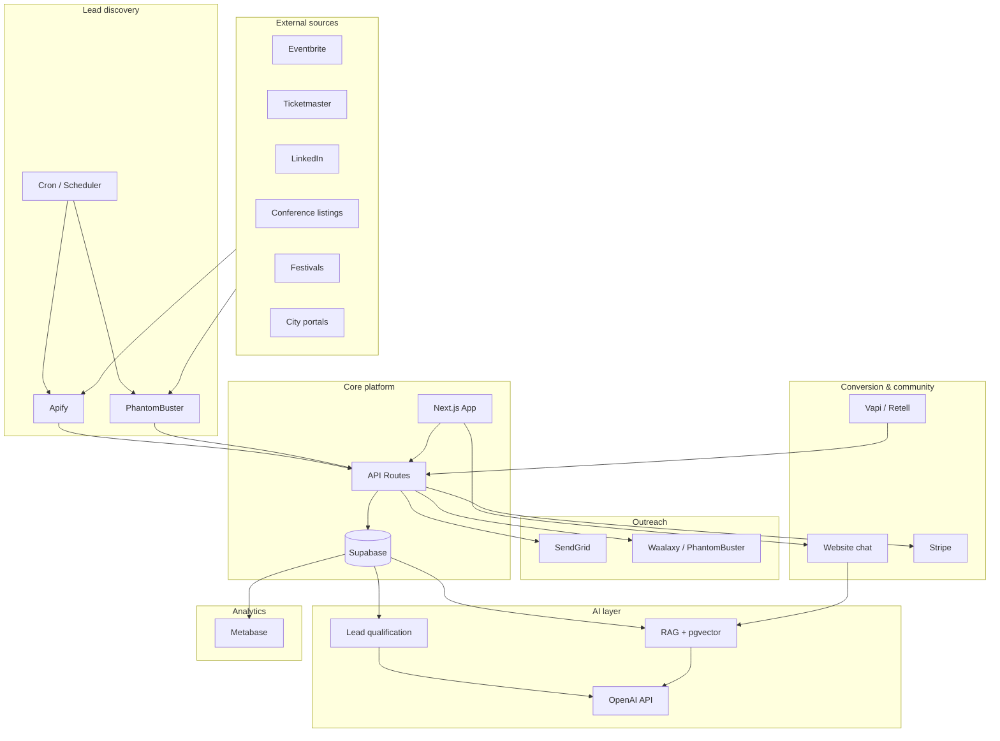
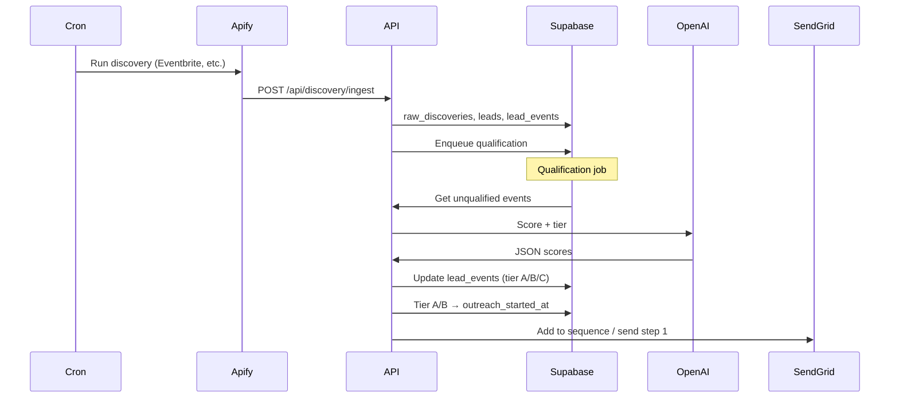
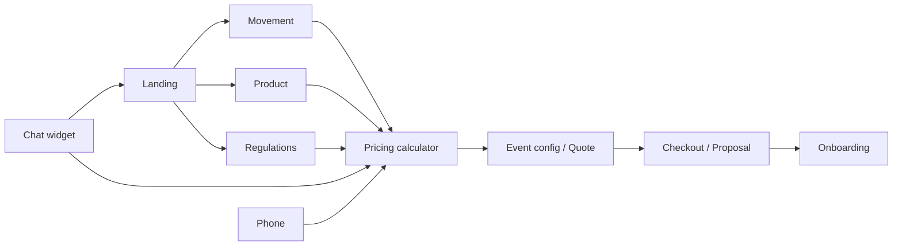
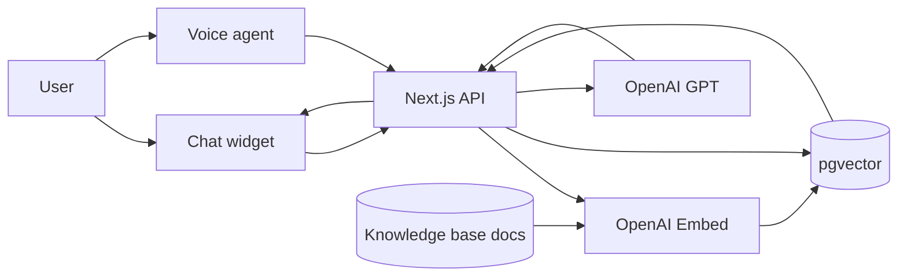
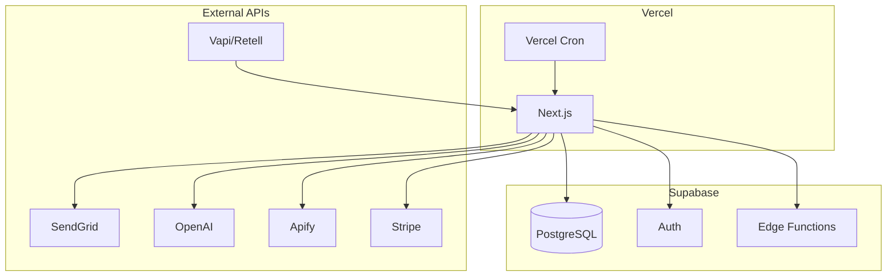

# System architecture — diagrams

## 1. High-level component diagram

## 2. Data flow: discovery → qualification → outreach

## 3. Website conversion flow (user journey)

## 4. RAG and AI agents

## 5. Deployment (Vercel + Supabase)

---

*Render Mermaid in GitHub, Notion, or https://mermaid.live to view diagrams.*
